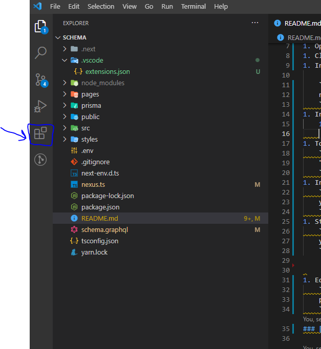
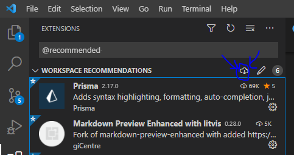

## 🚀 Quick start

1. Install [VSCode](https://code.visualstudio.com/)
1. Install [Node](https://nodejs.org/en/download/)
1. Install [Git](https://git-scm.com/)
1. [Create a GitHub user](https://github.com/join)
1. Open VSCode
1. Clone the repository
1. Install yarn global

    ```console
    npm install --global yarn
    ```
1. Install extensions:
    1. Go to extension:
        
    1. Type in:
        ```console
        @recommended
        ```
    1. Install all recommended(see picture)
        
     


1. To automatically format on save, add the following to your settings.json file
    ```console
    "editor.formatOnSave": true
    ```
1. Install Packages
    ```console
    yarn add
    ```
1. Start server
    ```console
    yarn dev
    ```


1. Edit schema and database:
    ```console
    prisma generate
    ```
### [Frontend](http://localhost:3000)

### [Backend](http://localhost:3000/api/graphql)


